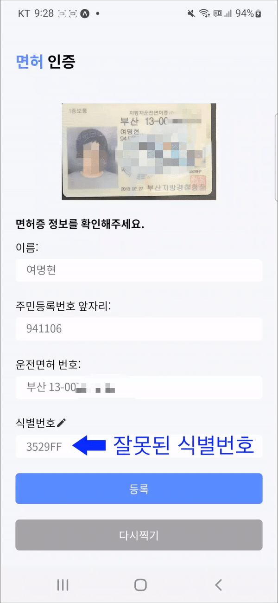
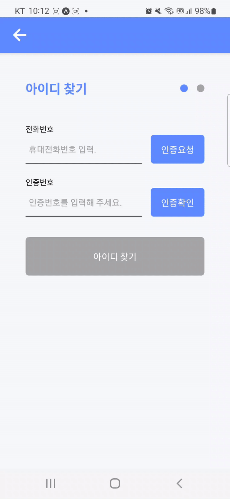
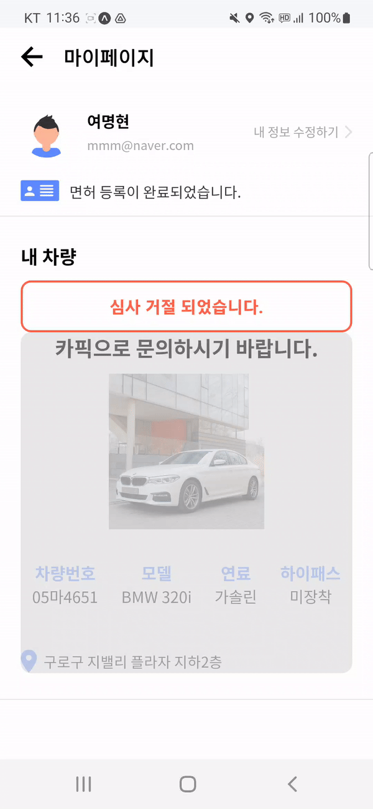
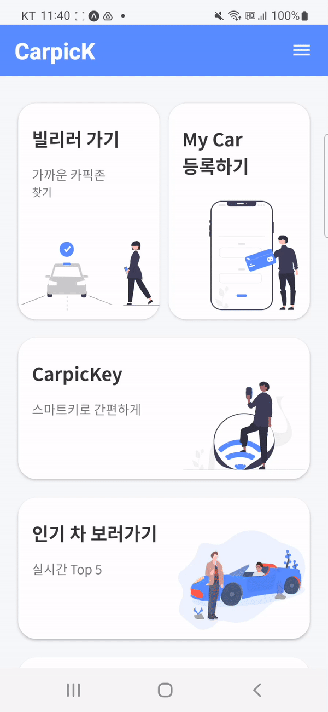
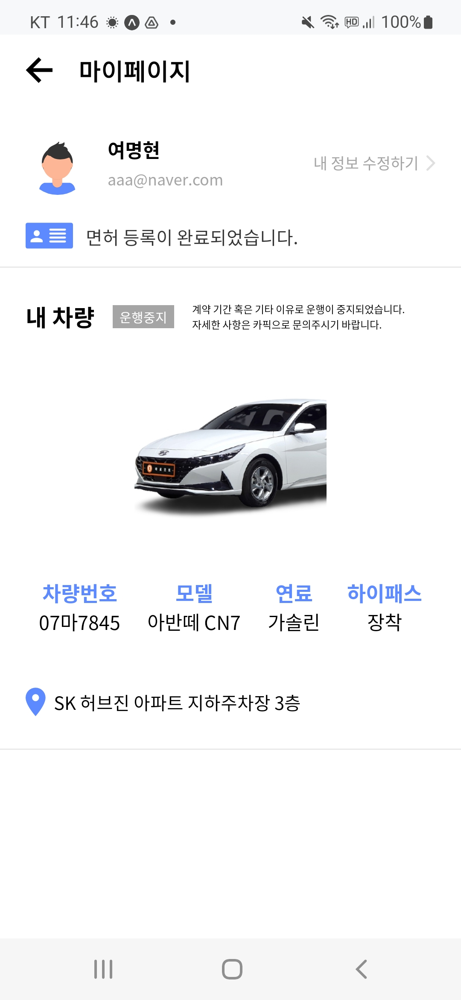

# 🚙 CarpicK
### 이웃 간 차량공유 서비스

물건은 더이상 ‘소유’의 개념이 아닌 서로 대여해 주고 차용해 쓰는 ‘공유’의 개념이 되고 있습니다. 

잘 사용하지 않는다면 기꺼이 대여하여 자신과 남 모두 win win 하며,

불필요한 재화의 재생산을 막아주는 공유경제 개념이 자동차에 접목 되었습니다.

**React native(expo)** 를 이용하여 빌드된 하이브리드 어플리케이션 입니다.

## 팀원소개

## 관리자 페이지

    
    

## 어플리케이션 시연
    
#### **Splash-Image** / **Landing-Page** / **Social-Login**
    

    
    
    

    
- SplashScreen 구현  
- 캐러셀을 이용한 소개페이지   
- 구글 소셜로그인 구현   

#### **회원가입** / **운전면허증 식별** / **운전면허증 진위여부 확인**
    

    
    
    

- 회원가입-graphQL-backend
- GoogleVision 이미지 OCR 운전면허증 텍스트 추출
- 운전면허증 진위여부 확인 *[경찰청교통민원24조회](https://tilko.net/Help/Api/POST-api-apiVersion-Efine-LicenTruth)

#### **운전면허증 잘못된 면허증정보** / **운전면허증이 아닌사물**

    
    

- 잘못된 운전면허 정보를 통해 인증시
- 운전면허증이 아닌사물 예외처리

#### **아이디 찾기** / **비밀번호 재설정**

    
    

- 휴대전화 인증을 통한 아이디찾기/비밀번호 재설정

#### **Main-Screen** / **My-Page**

    
    

- 사이드바 메뉴  @react-navigation/drawer

#### **Map-예약 및 결제** / **Map-필터**

    
    

- 구글맵 마커(카픽존), 아임포트 결제
- 원하는차량 필터기능 구현

#### **CarpicKey-이용시작** / **차량 반납하기**

    
    

- 예약취소기능 구현
- 이미지 피커 (expo-image-picker)

#### **MyCar-등록** / **심사-거절** / **심사-통과** / **운행중지**

    
    
    
    

- 마이카 등록 심사 상태구분
- 운행중 , 운행중지 상태구분

#### **이용내역** / **반납지연 결제** / **마이카-운행현황** / **인기차**

    
    
    
    

- 내역 , 운행현황 히스토리
- 반납지연금 추가결제

