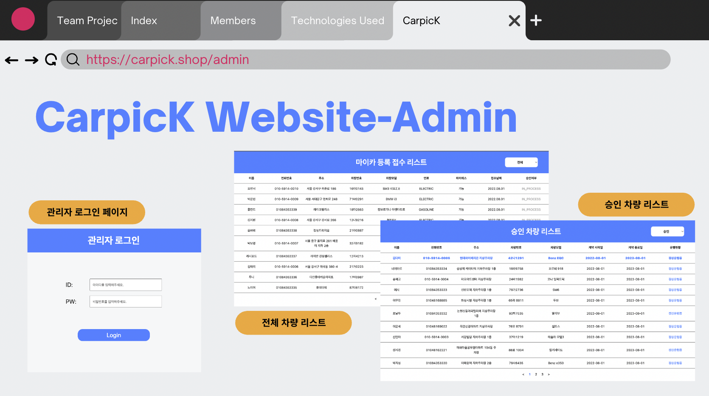

# 🚙 CarpicK
### 이웃 간 차량공유 서비스

물건은 더이상 ‘소유’의 개념이 아닌 서로 대여해 주고 차용해 쓰는 ‘공유’의 개념이 되고 있습니다. 

잘 사용하지 않는다면 기꺼이 대여하여 자신과 남 모두 win win 하며,

불필요한 재화의 재생산을 막아주는 공유경제 개념이 자동차에 접목 되었습니다.

**React native(expo)** 를 이용한 하이브리드 어플리케이션 입니다.

<a href="https://www.figma.com/file/ISJzAquvSCmdPW3V4Jm8So/CarpicK---%EC%B0%A8%EB%B9%8C%EB%A0%A4%EC%A1%B0?node-id=16%3A99">

## 팀원소개

## 관리자 페이지

    
    

## 어플리케이션 시연
    
#### **Splash-Image** / **Landing-Page** / **Social-Login**
    

    
    
    

    
- SplashScreen 구현  
- 캐러셀을 이용한 소개페이지   
- 구글 소셜로그인 구현   

#### **회원가입** / **운전면허증 식별** / **운전면허증 진위여부 확인**
    

    
    
    

- 회원가입graphQLbackend
- GoogleVision 이미지 OCR 운전면허증 텍스트 추출  
- 운전면허증 진위여부 확인 [경찰청교통민원24조회](https://tilko.net/Help/Api/POST-api-apiVersion-Efine-LicenTruth)   
